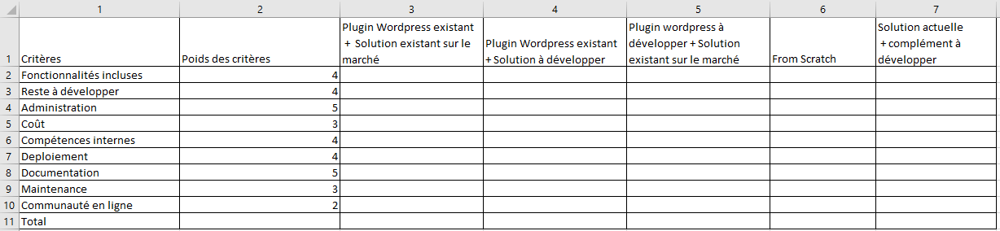

# Correction exercice 1 : analyse des besoins du client

---

## Généralités sur l'activité

### Activités principales

- Gestion de la partie commerciale (trouver des clients, étudier leurs besoins)
- Gestion de la partie opérationnelle (shooting, retouches)

### Généralités et observation sur le métier

- Travail de recherche
- Allier sensibilité et rigueur technique
- Métier artistique (esthétisme, émotions)
- Appareils numériques
- Retouches avec des logiciels (post-production)
- De plus en plus digitalisé au contact de l'innovation donc les personnes sont plutôt à l'aise avec les outils numériques

### Matériels

- Appareils de photo
- Des objectifs
- Batteries
- Téléphone

## Spécifiques à notre client

- Portrait particulier
- Création book comédiens
- Spécialisée  dans les mariages
- Spécialisée  dans la photographie de beauté

---

### Communication du client

- Possède un blog
- Possède un site vitrine
- Reconnu dans son milieu (publications de ses photos dans certaines magasines et blogs de mariage)
- Bien référencée sur le moteur de recherches Google

---

## Questions

Il est important ici de mener ou d'envisager un entretien avec le client pour cadrer et spécifier ses besoins.
En effet, le client a décrit une solution (CRM) au lieu de décrire vraiment des besoins.

Il faudra également demander au client, comment est-ce qu'elle travaille actuellement sur son quotidien, la gestion des clients, contrats et séances.

Par exemple :
- 10 % shooting (prise des photos)
- 25 % retouches
- 10 % administratifs
- 10 % commerciale
- 20 % production et impressions
- 15 % publicité, gestion du réseau
- 5 % gestion du matériel
- 5 % formation

On remarque également plusieurs redondances et synonymes des éléments en notre possession. Il faut s'assurer de parler le même langage ou à défaut développer le même langage ensemble (employer le même vocabulaire, même définition des mots) avec le client.

On peut se poser les questions suivantes :

- Qu'est-ce qu'un dossier ?
- Qu'est-ce qu'un projet ?
- Quelles sont les différences entre un projet et un dossier ?
- Qu'est-ce qu'une séance ?
- Qu'est-ce qu'un événement ?
- Quelles sont les différences entre une séance et un événement ?

Et d'autres questions ouvertes pour bien cibler les besoins.

---

## Contraintes

La contrainte principale ici est de potentiellement devoir utiliser le site web actuel donc cela nécessite d'avoir les ressources compétentes sur le CMS Wordpress en interne. Autrement dit une dépendance envers Wordpress et ses technologies.

---

## Approche CQQOQCCP

#### Combien

- Budget prévisionnel (cout des ressources humaines et matériels (logiciels, licences, serveurs etc...)) à définir

#### Quoi

- Une application de gestion de la relation client et de l'activité au quotidien
- Possède un site Wordpress vitrine et un blog

#### Qui

- Photographe basée en région parisienne (notre client)
- Ses clients (On peut identifier plusieurs cibles selon le parcours client défini par notre client)
- Equipe interne
- Exploitants (hébergeur, agence ou personne gérant les sites actuels)

#### Où

- Pour le moment, avec les informations en notre possession, on part de l'hypothèse que tout sera géré par notre entreprise (Formalisation, Conception, Production et Exploitation).

#### Quand

- Réunion de lancement projet kick-off
- Les jalons (dates clés)

#### Comment

- Contrat
- Les livrables
- Les outils collaboratifs
- L'organisation interne

#### Pourquoi

- Gain de productivité
- Gain dans l'organisation

---

## Solutions envisageables

En se basant sur l'existant, à savoir le site web développé par Wordpress, on peut envisager d'effectuer un benchmark des [plugins CRM existant](https://www.hostinger.fr/tutoriels/crm-wordpress) pouvant répondre aux besoins.

1. En se basant toujours sur l'existant, on peut développer un plugin Wordpress sur mesure (API) qui communiquera avec l'application à développer.

2. On peut proposer une solution CRM déjà existant par exemple une solution Salesforce personnalisé relié à un [plugin Wordpress à Salesforce](https://wordpress.org/plugins/salesforce-wordpress-to-lead/)

3. Partir de la solution de gestion du client actuel existant dont on ignore les caractéristiques et développer le complément.

4. Développer from scratch une application qui répond aux besoins.

