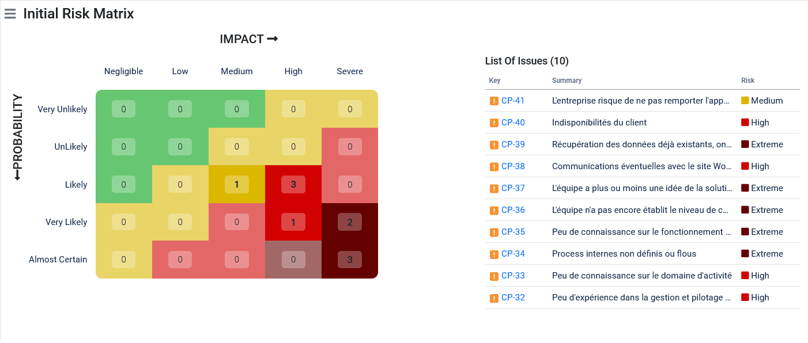

# Correction exercice 3 : analyse des risques

---

## SWOT (Strenghts, Weakness, Opportunities, Threats)

Toutes les hypothèses émisent ci-après sous à lever en collaborant avec notre client pour avoir plus de précision.

---

### Forces internes

- Équipe polyvalente (profils variés, tech et non tech en reconversion)
- Peu d'exigence du client en termes de délai (hypothèse)
- En cours de formation sur le développement d'une solution CRM leadeur sur le marché (Salesforce)
- Des bons éléments dans l'équipe au niveau technique
- Motivation de l'équipe
- Des bons éléments dans l'équipe au niveau fonctionnelle
- Accès aux applications déjà existantes (hypothèse, d'après les mentions légales, le client administre et gère lui-même l'hébergement donc on pourra facilement récupérer les applications si nécessaire).

---

### Faiblesses internes

- Equipe peu expérimentée
- Client peu disponible en tenant compte de la répartition de ses tâches quotidiennes et de sa géolocalisation (région parisienne, concurrence importante) (hypothèse)
- Implication du client (hypothèse en se basant sur le nombre des interactions et la date de publication de l'annonce)

---

### Opportunités externes

- En-dehors de ce projet, on peut nouer un partenariat avec le client pour effectuer des photos pour notre entreprise ou nos autres clients.
- En-dehors des besoins exprimés par le client  et pour Fabrice notre commercial, une proposition de refonte du site.

---

### Menaces externes

- Concurrence avec les autres agences (17 offres reçues par le client), il faudra veiller à ne pas être trop chère et ne pas trop s'aligner non plus au risque de réduire notre marge commerciale.

---

## Risques

---

### Coût

#### Causes

- Pas de budget établit avec le client
- S'aligner pour remporter l'appel d'offre (risque de réduire la marge commerciale ou d'être en perte)
- Cout faible si on part sur une solution qui nécessite uniquement de l'administration et donc avoir un collaborateur qui pourra accompagner le client.

#### Conséquences

- Mauvaise évaluation des ressources

#### Contre-mesures préventives

- Consacrer plus de temps à la budgétisation du projet.
- Bien comprendre les besoins en multipliant si nécessaire les entretiens avec le client.
- Refuser le projet si la marge commerciale est trop basse.

#### Contre-mesures de réparation

- Réduction de la marge commerciale en respectant les règles appliquées dans l'entreprise

---

### Délais

#### Causes

- Pas d'estimation de temps établie (planning)

#### Conséquences

- Pas d'affectation des ressources sur le projet

#### Contre-mesures préventives

- Prendre davantage de marge sur le planning
- Connaître  les disponibilités des membres de l'équipe

#### Contre-mesures de réparation

- Affecter plus de ressources
- Faire appel à de la sous-traitance

---

### Qualité et périmètre fonctionnel

#### Causes

- Besoins mal définis par le client, risque d'avoir des fonctionnalités qui ne répondent pas à ses besoins
- À première vue, volume faible des fonctionnalités mais le volume de fonctionnalités risque d'accroitre lorsque les besoins seront plus précises, attention à la mobilisation des ressources humaines.

#### Conséquences

- Nouveaux besoins
- Décalage dans le planning (date de fin du projet repoussée, peu impacter les autres projets)

#### Contre-mesures préventives

- Bien définir le périmètre fonctionnel
- Bien prioriser les fonctionnalités (développer les fonctionnalités critiques et importantes en premiers, se mettre d'accord avec le client pour réduire le périmètre fonctionnel dans l'hypothèse où son budget est insuffisant)

#### Contre-mesures de réparation

- Développer et livrer moins de fonctionnalités

---

### Équipe (attention, si le document est partagé avec le client, il faut veiller à ne pas se tirer des balles dans le pied sur cette partie, trouver le bon équilibre et vocabulaire)

#### Causes

- Peu d'expérience dans ce type de projet malgré la maîtrise technique.
- Peu de compétences dans les CMS Wordpress, ce n'est pas l'expertise de nos développeurs cependant la formation et la montée en compétence est facile.
- [Peu d'expérience dans la gestion et pilotage du projet]
- [Peu de connaissance sur le domaine d'activité]
- [Process internes non définis ou flous]

#### Conséquences

- Difficultés techniques qui peuvent retarder les échéances et les livrables opérationnels
- Suroptimisation des fonctionnalités ou en deçà des exigences de qualité
- Redéfinition des besoins
- Client insatisfait

#### Contre-mesures préventives

- Formation de l'équipe en interne ou en externe en ayant recours à un organisme de formation ou coach
- Mettre l'accent sur la satisfaction client
- Mettre en place des proccess clairs et transparents pour tout le monde

#### Contre-mesures de réparation

- Faire appel à un expert via les plateformes de freelancing avec des TJM de 750 €

---

### Organisation interne

#### Causes

- Peu de connaissance sur le fonctionnement du management de l'entreprise concernant la prise de décision, la politique commerciale.

#### Conséquences

- Prise de décision longue qui peut impacter les délais

#### Contre-mesures préventives

- S'entretenir avec son management pour bien connaître la stratégie commerciale de l'entreprise, le fonctionnement interne sur la budgétisation, les leviers, la prise de décision et les délais des procédures internes, les outils, la demande des ressources matérielles ou humaines supplémentaires, etc.

---

### Complexité et innovation

#### Causes

- L'équipe n'a pas encore établi le niveau de complexité global du projet
- L'équipe a plus ou moins une idée de la solution (incertitude sur les choix technologiques)
- Communications éventuelles avec le site Wordpress (échanges des données)
- Récupération des données déjà  existantes, on ignore le fonctionnement actuel de l'entreprise.

#### Conséquences

- Conflit interne
- [Non-adhésion de certains collaborateurs à la solution => perte de motivation]
- Retard dans les échéances
- Développements additionnels pour intégrer les données existantes

#### Contre-mesures préventives

- Benchmarketing des solutions possibles
- Atelier pour déterminer le(s) livrable(s)
- Atelier d'estimation globale du projet
- Challenger l'équipe

#### Contre-mesures de réparation

- Faire appel à de la sous-traitance
- Former les équipes à la création des API REST

---

## Spécifique au projet

#### Causes

- Indisponibilités du client
- L'entreprise risque de ne pas remporter l'appel d'offre
- Forte concurrence

#### Conséquences

- Pas de validation du client
- Moins d'interaction avec le client, risque d'interprétation du besoin, effet tunnel.
- Passez moins de temps sur la phase d'estimation et proposez une offre en deçà des exigences du client
- Passez trop de temps pour essayer de remporter l'appel d'offre

#### Contre-mesures préventives

- Impliquer davantage le client
- Livrer régulièrement
- Demander au client de partager son agenda

### Contre-mesures de réparation

- Accompagner le client dans sa conformité RGPD

---

## Juridiques

#### Causes

- L'observation du site internet soulève une non-conformité aux principes exigés par le RGPD : `"Vous pouvez utiliser le site internet sans avoir à fournir des informations vous concernant. Mais il est possible que vous ayez à renseigner vos données personnelles dans certains cas: prise de contact"`

#### Conséquences

- Client exposé aux sanctions de la CNIL, dans l'hypothèse ou l'on reprend la maintenance de son site, il peut potentiellement nous rejeter la faute.

#### Contre-mesures préventives

- Sensibilisation du client et de l'équipe sur le RGPD
- Mener un audit axé sur les données personnelles
- Demander le consentement sur tous les formulaires qui peuvent exploiter les données personnelles (DP) aussi bien sur le site actuel que notre future solution
- Récolter les DP au strict nécessaire
- Demander toutes les DP à récolter, questionner leurs pertinences par rapport aux objectifs à atteindre
- Porter une attention aux types des DP (elles doivent être légales et pertinentes par rapport à la finalité)
- Développer une fonctionnalité pour récupérer les DP dans un format lisible 
- Développer une fonctionnalité pour révoquer/supprimer ses DP

#### Contre-mesures de réparation

- Mise en conformité
- Expertise d'un juriste en protection des données personnelles

---

## Priorisation des risques

