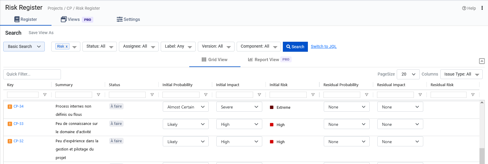

# Exercice 3 : analyse des risques du projet

## Ressources

- Utilisez *Jira*
- Créez un nouveau type de ticket nommé *Risk*
- Ajoutez l'app [Risk register](https://marketplace.atlassian.com/apps/1225439/risk-analyzer-for-jira-free?hosting=cloud&tab=overview)

---

## Énoncé

1. Faites une **analyse SWOT** (forces, faiblesses, opportunités et menaces) en tenant compte de tous les acteurs (équipe interne, client, éventuels prestataires, la concurrence, les acteurs externes, etc...).

2. Identifiez les **risques** à partir des axes ci-dessous et explicitez les conséquences sur le déroulement du projet. Pour chaque risque identifié, créer un nouveau ticket *Risk* sur *Jira*.

Voici les différentes catégories des risques : 
- Coût
- Qualité et périmètre fonctionnel
- Délai
- L'équipe (compétences, disponibilités, expériences, etc.)
- Organisation interne (stratégie commerciale, management, etc.)
- Complexité et innovation du projet
- Les risques spécifiques (propres) au projet
- Les risques juridiques
- Et d'autres risques opérationnels que vous pouvez identifier

3. **Priorisez** les risques. 
Sur *Jira*, en utilisant l'app *Risk register*
- 3.1 Filtrez et gardez uniquement les tickets de type *Risk*
- 3.2 Évaluez la **probabilité** et l'**impact** de chaque risque pour en déduire sa **criticité**.

4. Proposez des **contre-mesures préventives et/ou de réparations** pour chaque risque identifié.

---

### Exemples du travail attendu

#### Évaluation des risques sur l'axe coût

##### Causes

- Pas de budget établit avec le client
- Concurrence des autres agences pour remporter l'appel d'offre

##### Conséquences

- Mauvaise évaluation des ressources
- S'aligner pour remporter l'appel d'offre (risque de diminuer la marge ou d'être en perte)

##### Contre-mesures préventives

- Consacrer plus de temps à la budgétisation du projet.
- Bien comprendre les besoins en multipliant les entretiens avec le client.
- Refuser le projet si la marge commerciale est trop basse.

##### Contre-mesures de réparation

- Réduction de la marge commerciale en respectant les règles appliquées dans l'entreprise

### Exemple de priorisation des risques avec l'app *Risk register*

---

## Rappel de l'offre

Je suis un photographe indépendant et j'ai besoin d'un CRM adapté à mes besoins.
- gestion des clients (nom, courriel, adresse postale, téléphone, sexe, date de naissance, réseaux sociaux, etc.)
- système de signature de contrats
- gestion des dossiers /projets (séances)
- gestion des événements (vue des séances sur calendrier)

[Lien de l'appel d'offre](https://www.codeur.com/projects/330179-creation-d-un-crm)

PS : *ne vous fiez pas au budget indicatif indiqué sur le site, il s'agit du prix par défaut lorsque le client n'a pas spécifié cette info*.

[Le site web actuel du client](https://justinehphotography.com/)
